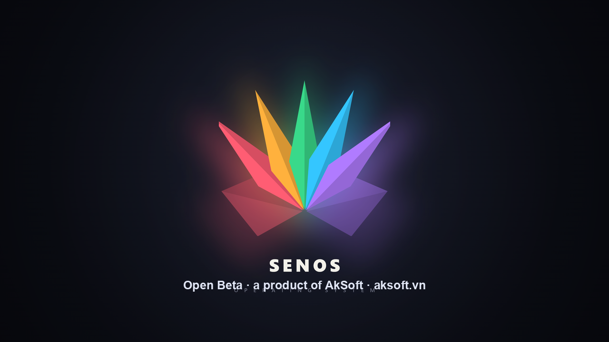

<p align="center">
  
</p>

<h1 align="center">SenOS</h1>

<p align="center">
  <strong>Simple Vietnamese Linux — Hệ điều hành Linux đơn giản, mượt mà cho người Việt</strong>
</p>

<p align="center">
  <em>SenOS — một sản phẩm của <a href="https://aksoft.vn">AkSoft</a>, mang Linux đến gần hơn với người dùng Việt</em>
</p>

<p align="center">
  <a href="README_EN.md">English</a> · <a href="https://vietnamlinuxfamily.net">VNLF</a> · <a href="https://senos.vietnamlinuxfamily.net">Website</a>
</p>

<p align="center">
  Phát triển bởi: <a href="https://www.facebook.com/groups/vietnamlinuxcommunity">VNLF</a> · <a href="https://www.facebook.com/mrd.900s/">MRD</a> · <a href="https://www.facebook.com/tam.nguyet.that">Kỳ Nguyễn</a>
</p>

---

## SenOS là gì?

**SenOS** là bản phân phối Linux dựa trên **Linux Mint 22.3 Cinnamon**
(Ubuntu 24.04 LTS), được thiết kế đặc biệt cho **người dùng Việt Nam**.
Dự án được build theo hướng **ISO remaster**: bung ISO Linux Mint gốc,
tuỳ biến rootfs bằng packages/overlay/hooks, rồi đóng gói lại thành ISO SenOS.

> [!IMPORTANT]
> **Phiên bản hiện tại:** `1.0.1` — **Open Beta**.
> SenOS đang mở beta để lấy ý kiến từ cộng đồng. Dự án rất hoan nghênh
> mọi góp ý, báo lỗi, đề xuất cải tiến giao diện, package, trải nghiệm cài đặt
> và các ý tưởng giúp SenOS thân thiện hơn với người dùng Việt Nam.

Mục tiêu của SenOS là phổ thông hoá Linux — giúp người dùng Việt chuyển từ
Windows sang Linux dễ hơn, có sẵn giao diện thân thiện, bộ gõ tiếng Việt,
trình duyệt, ứng dụng văn phòng và các tiện ích quen thuộc.

## Tính năng nổi bật

| Tính năng | Mô tả |
|---|---|
| **Dựa trên Linux Mint 22.3** | Nền Ubuntu 24.04 LTS ổn định, desktop Cinnamon quen thuộc |
| **Giao diện SenOS** | Branding SenOS, boot menu/Plymouth, logo, wallpaper, panel và theme được tuỳ biến |
| **Tiếng Việt mặc định** | Locale Việt Nam, timezone Asia/Ho_Chi_Minh, font Be Vietnam Pro |
| **Bộ gõ tiếng Việt** | ibus-bamboo được cài và cấu hình sẵn (gõ Telex) |
| **Google Chrome** | Trình duyệt phổ biến được cài sẵn |
| **WPS Office** | Bộ ứng dụng văn phòng thân thiện với người dùng chuyển từ Windows |
| **Zalo** | Zalo AppImage được cài sẵn và có shortcut ngoài Desktop |
| **Cinnamon Delight + Tela/Bibata** | Theme, icon và cursor hiện đại, nhẹ, dễ nhìn |
| **Neofetch/Fastfetch SenOS** | Logo ASCII màu và OS identity đồng bộ theo version SenOS |
| **Build linh hoạt** | Dev build nhanh bằng `lz4`, release build nhỏ hơn bằng `xz`, hỗ trợ Docker |

<p align="center">
  
</p>

## Trải nghiệm SenOS

Từ boot menu đến desktop, SenOS được tuỳ biến đồng bộ để mang lại cảm giác
thân thiện, hiện đại và sẵn sàng cho người dùng Việt Nam.

| Bước | Hình ảnh |
|---|---|
| **1. GRUB boot menu**<br>Chọn live session hoặc cài đặt SenOS. |  |
| **2. Startup loading**<br>Màn hình khởi động/Plymouth branding. |  |
| **3. Desktop**<br>Giao diện Cinnamon đã tuỳ biến theme, icon, panel và wallpaper. |  |
| **4. Neofetch**<br>Thông tin hệ thống và nhận diện SenOS trong terminal. |  |

## Công nghệ sử dụng

| Thành phần | Công nghệ / cấu hình hiện tại |
|---|---|
| **Base ISO** | Linux Mint 22.3 Cinnamon 64-bit |
| **Ubuntu base** | Ubuntu 24.04 LTS / noble |
| **Desktop** | Cinnamon |
| **Display manager** | LightDM theo Linux Mint base |
| **Build method** | ISO remaster: extract → customize → repack |
| **Build scripts** | Bash + Makefile |
| **Compression dev** | SquashFS `lz4` |
| **Compression release** | SquashFS `xz` |
| **Theme** | Cinnamon Delight |
| **Icons** | Tela circle / Cinnamon Delight Icons |
| **Cursor** | Bibata |
| **Font** | Be Vietnam Pro |
| **Input method** | ibus-bamboo |
| **Browser** | Google Chrome |
| **Office** | WPS Office |
| **Chat** | Zalo AppImage |

## Cấu trúc dự án

```text
./
├── build.sh              # Script build chính
├── Makefile              # Target build/dev/release/debug
├── scripts/              # Module build
│   ├── config.sh         # Version, base ISO, mirror, output ISO
│   ├── utils.sh          # Log, deps, download ISO, mount helpers
│   ├── extract.sh        # Mount ISO + rsync + unsquashfs
│   ├── customize.sh      # Chroot + packages + overlay + hooks
│   ├── repack.sh         # mksquashfs + xorriso
│   ├── boot_config.sh    # Boot menu + Plymouth branding
│   ├── overlay.sh        # Copy config/includes.chroot vào rootfs
│   ├── chroot_shell.sh   # Debug chroot
│   └── debug_iso.sh      # Kiểm tra ISO/boot branding
├── config/
│   ├── packages.txt      # Packages cài thêm
│   ├── hooks/live/       # Hook chạy trong chroot theo thứ tự NNNN-*.hook.chroot
│   └── includes.chroot/  # Overlay copy trực tiếp vào rootfs
├── assets/               # Logo/banner/source assets
├── Dockerfile            # Docker builder
└── docker-compose.yml    # Docker build entrypoint
```

## Version & release model

SenOS dùng mô hình version giống Linux kernel: **version nằm trong source tree**,
không lấy tag làm nguồn duy nhất.

Version được khai báo trong [scripts/config.sh](scripts/config.sh):

```bash
SENOS_VERSION_MAJOR=1
SENOS_VERSION_MINOR=0
SENOS_VERSION_PATCH=1
SENOS_VERSION_EXTRA=""
SENOS_CODENAME="Open Beta"
SENOS_VERSION="${SENOS_VERSION_MAJOR}.${SENOS_VERSION_MINOR}.${SENOS_VERSION_PATCH}${SENOS_VERSION_EXTRA}"
```

Version này được dùng cho:

- tên ISO: `SenOS-<version>-cinnamon-amd64.iso`
- boot menu/boot branding
- `/etc/os-release`
- `/etc/lsb-release`
- `/etc/linuxmint/info`
- `neofetch` / `fastfetch`
- GitHub Release artifact

Khi release production, Git tag phải khớp version trong source.
Ví dụ source version là `1.0.1` thì tag hợp lệ là:

```bash
v1.0.1
```

Nếu tag không khớp, GitHub Actions sẽ fail trước khi build release.

## Build ISO local

Cài dependency build trên Ubuntu/Mint/Debian:

```bash
sudo apt update
sudo apt install squashfs-tools xorriso rsync wget curl isolinux syslinux-common syslinux-utils
```

Build dev đầy đủ, nén `lz4` để test nhanh:

```bash
make build
```

Build release local, nén `xz` để ISO nhỏ hơn:

```bash
make release
```

Build từ ISO Mint có sẵn:

```bash
make build ISO=linuxmint-22.3-cinnamon-64bit.iso
```

## Make targets

| Lệnh | Mục đích |
|---|---|
| `make build` | Build dev đầy đủ, nén `lz4` |
| `make release` | Build release, nén `xz` |
| `make prepare` | Bung ISO/rootfs ra `build/` để sửa nhanh |
| `make customize-only` | Chạy packages, overlay và hooks trong rootfs |
| `make overlay` | Chỉ copy `config/includes.chroot` vào rootfs |
| `make quick` | Prepare nếu cần, overlay, repack squashfs và ISO |
| `make repack` | Đóng gói lại squashfs và ISO từ work tree hiện có |
| `make iso-only` | Chỉ tạo lại ISO từ `build/custom` |
| `make boot-only` | Chỉ áp dụng boot menu, GRUB và Plymouth branding |
| `make shell` | Vào chroot `build/squashfs` để debug thủ công |
| `make debug-iso` | Kiểm tra boot menu/Plymouth/branding của ISO |
| `make clean` | Xoá build/cache/output ISO |
| `make clean-work` | Xoá work tree, giữ cache extract |
| `make clean-cache` | Xoá cache extract/work tree |
| `make docker-build` | Build dev trong Docker |
| `make docker-release` | Build release trong Docker |
| `make docker-clean` | Clean build bằng Docker |

## Workflow sửa nhanh

Sau lần build/prepare đầu tiên, nếu chỉ sửa overlay/hook/theme/app config:

```bash
make customize-only
make quick
```

Nếu chỉ sửa boot menu/Plymouth:

```bash
make boot-only
make iso-only
```

Debug trong chroot:

```bash
make shell
```

## Docker build

Dùng Docker nếu máy không phải Ubuntu/Mint/Debian phù hợp:

```bash
make docker-build
```

Release build trong Docker:

```bash
make docker-release
```

## GitHub Actions release

Workflow CI nằm ở [.github/workflows/build.yml](.github/workflows/build.yml).

- Push/PR vào branch `main` hoặc `develop`: build dev ISO bằng `./build.sh`.
- Push tag `v*`: kiểm tra tag khớp source version, build release bằng `./build.sh --release`, tạo `SHA256SUMS`, upload artifact và tạo GitHub Release.

Quy trình release `1.0.1`:

```bash
# 1. Bump version trong scripts/config.sh nếu cần
# SENOS_VERSION_MAJOR=1
# SENOS_VERSION_MINOR=0
# SENOS_VERSION_PATCH=1

# 2. Commit và merge vào main
git add scripts/config.sh
git commit -m "[release] bump SenOS to 1.0.1"
git push

# 3. Sau khi merge main
git checkout main
git pull origin main
git tag v1.0.1
git push origin v1.0.1
```

GitHub Release sẽ đính kèm:

```text
SenOS-1.0.1-cinnamon-amd64.iso
SHA256SUMS
```

## Cài đặt cho người dùng cuối

### 1. Tải ISO

Tải ISO từ trang GitHub Releases của dự án sau khi có bản phát hành.

### 2. Ghi ra USB

Linux/macOS:

```bash
sudo dd if=SenOS-1.0.1-cinnamon-amd64.iso of=/dev/sdX bs=4M status=progress oflag=sync
```

Hoặc dùng Balena Etcher/Ventoy trên mọi hệ điều hành.

### 3. Boot và cài đặt

1. Khởi động lại máy, vào BIOS/UEFI bằng F2/F12/Del/Esc tuỳ máy.
2. Chọn boot từ USB.
3. Chọn live session hoặc **Cài đặt SenOS**.
4. Làm theo hướng dẫn cài đặt trên màn hình.

## Đóng góp

Xem [CONTRIBUTING.md](CONTRIBUTING.md) để biết thêm về kiến trúc, quy ước hook,
quy trình build/test và hướng dẫn đóng góp.

Quy ước nhanh:

| Task | Vị trí |
|---|---|
| Thêm package | `config/packages.txt` |
| Tạo hook mới | `config/hooks/live/NNNN-name.hook.chroot` |
| Sửa overlay hệ thống | `config/includes.chroot/` |
| Sửa version | `scripts/config.sh` |
| Sửa workflow release | `.github/workflows/build.yml` |

## Contributors

Cảm ơn tất cả thành viên đã đóng góp cho SenOS trên GitHub.

<p align="center">
  <a href="https://github.com/VN-Linux-Family/SenOS/graphs/contributors">
    
  </a>
</p>

## Giấy phép

SenOS là phần mềm mã nguồn mở theo giấy phép [GPL-3.0](LICENSE).

## Cảm ơn

- [Linux Mint](https://linuxmint.com/) — Base distro tuyệt vời
- [Ubuntu](https://ubuntu.com/) — Nền tảng LTS ổn định
- [VNLF (Vietnam Linux Family)](https://vietnamlinuxfamily.net) — Cộng đồng Linux Việt Nam
- [DrMcC0y](https://github.com/DrMcC0y) — Cinnamon Delight theme/icons
- [vinceliuice](https://github.com/vinceliuice) — Tela Circle icons
- [ful1e5](https://github.com/ful1e5) — Bibata cursor
- Cộng đồng Linux/FOSS Việt Nam

---

<p align="center">
  <strong>SenOS</strong> — Simple Vietnamese Linux<br>
  Made with love by <a href="https://vietnamlinuxfamily.net">Vietnam Linux Family</a>
</p>
